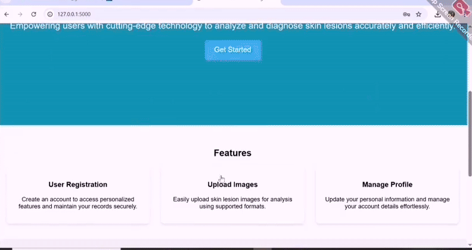

## 🎥 Demo



### 🩺 KSFormer: Skin Lesion Segmentation

### 📌 Overview
This project presents **KSFormer**, a skin lesion segmentation model that combines a **SegFormer backbone** with **custom attention & convolutional modules** for better accuracy.  

**Datasets**: ISIC-2018 and PH2  

---

### 🧠 Model
- **Encoder**: Pretrained SegFormer-B3 (frozen)  
- **Enhancements**:  
  - KSCO blocks (feature refinement)  
  - CBAM attention  
  - STFT & STET blocks  
  - Adaptive fusion decoder with skip connections  
- **Loss**: Dice + Tversky  
- **Metrics**: Dice, IoU, Precision, Recall, F1, Specificity  

### 🏋️ Training

- K-Fold cross validation (default 5 folds) using PyTorch Lightning.
```bash
python train.py --path_image_train x_train.npy --path_label_train y_train.npy \
                --path_image_test x_test.npy --path_label_test y_test.npy \
                --path_checkpoint ./checkpoints --batch_size 4 --max_epochs 100
```

### ✅ Testing & Visualization

- Evaluates on test set, averages metrics across folds.

- Supports Grad-CAM and sample segmentation outputs.
```bash
python test.py --path_checkpoints ./checkpoints/fold*/best.ckpt \
               --path_image_test x_test.npy --path_label_test y_test.npy \
               --gradcam --gradcam_indices 1 5
```
#####⚠️ Note: The full code is not publicly available until our paper is published. After publication, the code will be released here.”
